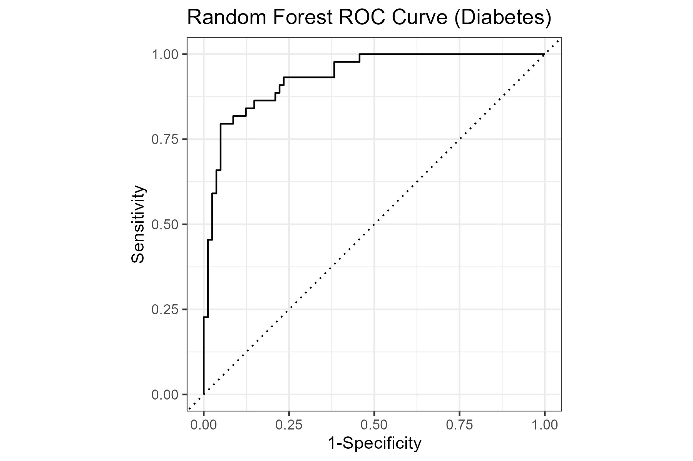
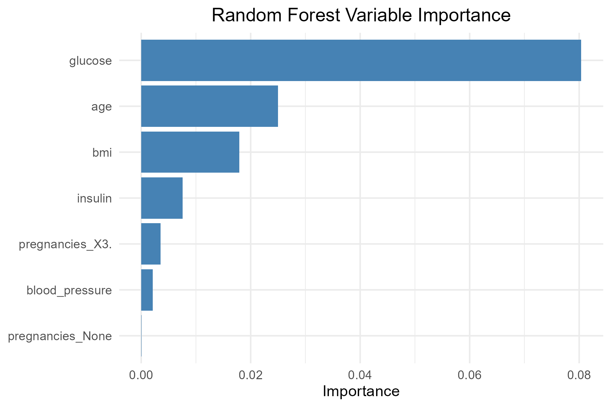

# Diabetes-Predictive-Models
This project builds predictive models for diabetes status using the Pima Indians diabetes dataset. The workflow includes data cleaning (removing impossible values), outcome recoding, and model development using tidymodels. Logistic regression and random forest models are evaluated with accuracy and ROC AUC, and ROC curves are visualized to compare performance. Variable importance is analyzed to highlight which health metrics contribute most to diabetes prediction.
---
## Objectives
- Build and evaluate a predictive model for diabetes classification
- Identify the most influential predictors
- Visualize model performance (ROC curve)
- Provide a reproducible workflow using R
---
## Project Structure
```text
Diabetes-Predictive-Models/
├── R/
│   └── Rodriguez_Katherine_Diabetes_Code.R
├── data/
│   └── diabetes.csv
├── results/
│   ├── roc_curve.png
│   └── variable_importance.png
├── README.md
└── .gitignore
```
---
## How to Run the Code
1. Install required packages:
   ```r
   install.packages(c("tidyverse", "tidymodels"))
2. Open the R script:
Rodriguez_Katherine_Diabetes_Code.R
3. Run the script from top to bottom. It will:
- load `diabetes.csv`
- clean and preprocess the data
- split into training/testing sets
- fit logistic regression and random forest models
- compute accuracy and ROC AUC
- generate and save `roc_curve.png` and `variable_importance.png`
4. The PNG files will appear in the project directory and are displayed below.
---
## Data Preparation
- Load the dataset with 500 observations and 7 variables
- Converted character variables to factors
- Replaced impossible values (0 for glucose, blood pressure, BMI) with NA
- Recoded the outcome variable into:
  - "No diabetes"
  - "Diabetes
---
## Modeling Workflow
- Train/test split (75/25) stratified by outcome)
- Preprocessing recipe:
  - Median imputation for numeric predictors
  - Mode imputation for nominal predictors
  - Dummy encoding
  - Remove zero-variance predictors
  - Normalize numeric predictors
---
## Models
- **Logistic Regression**
  - Interpretable baseline model
- **Random Forest**
  - 500 trees
  - Permutation-based variable importance
---
## Evaluation Metrics
- Accuracy and ROC AUC calculated on the test set
- Results:
  - Logistic Regression: Accuracy = 0.864, ROC AUC = 0.908
  - Random Forest: Accuracy = 0.896, ROC AUC = 0.934
---
## Visualizations
- ROC curve for random forest
- Variable importance plot showing:
  - Glucose as the strongest predictor
  - Age, BMI, and insulin are also contributing

### ROC Curve (Random Forest)


### Variable Importance (Random Forest)


---
## Summary
Both models performed well, with the random forest achieving slightly higher accuracy and ROC AUC. Variable importance results align with clinical expectations, highlighting glucose as the most influential predictor of diabetes risk.  
---
## Dependencies
- tidyverse
- tidymodels
- ggplot2
- dplyr
- randomForest
- pROC
---
## Future Work
- Add cross-validation
- Perform hyperparameter tuning
- Compare additional models (XGBoost, SVM, KNN)
- Explore feature engineering
- Evaluate fairness across demographic groups
- Deploy via Shiny or an API
---
## Acknowledgments
Dataset: Pima Indians Diabetes dataset (UCI Machine Learning Repository)

